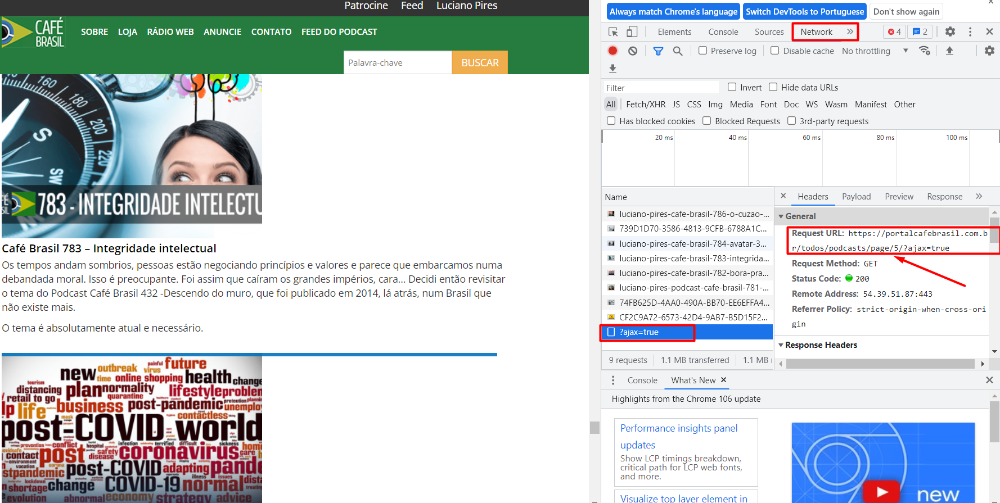
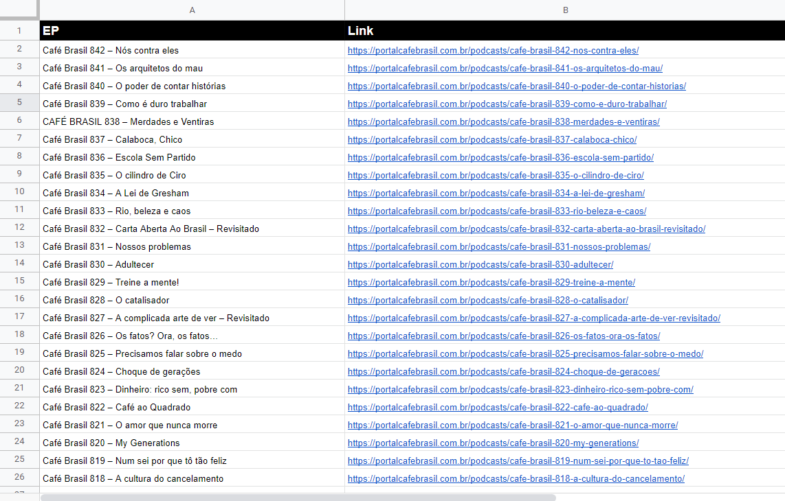

## Objetivo
Extrair dados de todos os episódios do podcast [Portal Café Brasil](https://portalcafebrasil.com.br/todos/podcasts/).

  
  <b>Site: Portal Café Brasil</b>

## Solução proposta
<b>Stacks:</b> Python (requests, bs4, logging, pandas e os)

A arquitetura do Web Scraper obedece etapas hierárquicas, é primeiramente definido os recursos necessários da biblioteca logging , utilizado para analisar todas requisições feitas, em seguida é definido a URL de acesso aos dados, vale observar que essa URL não é a mesma de acesso do site principal, o site por padrão não carrega totalmente de uma vez, é feito o carregamento dos dados conforme a barra de rolagem avança, dessa forma, se a requisição for feito ao site principal, não será possível coletar todos os dados e sim somente os carregados inicialmente, foi necessário fazer a requisição para o link encontrado no arquivo "ajax=true", "ajax=true" foi encontrado durante a inspeção de network da página, a barra de rolagem da página avança um novo arquivo "ajax=true" é  gerado com um novo link de requisição com a  paginação correta, "ajax=true" contem a paginação correta que o site requisita para fazer o carregamento dos dados conforme a necessidade, continuando, o script possui uma função chamada "get_podcast", ela já  recebe a URL de página correta, com um raspador a função "get_podcast" devolve uma lista com todos os cards encontrados na página em questão, em seguida termos o bloco de código com laço de repetição(While True), aqui é enviado o link com a página correta a ser acessada para a função "get_podcast", o retorno de "get_podcast" sendo uma lista com dados, dentro do loop com outro raspador é feito a extração dos dados de <b>Nome do episódio</b> e <b>Link do episódio</b> em todos elementos da lista, caso o retorno da função "get_podcast" for igual a uma lista vazia significa que não existe mais página a serem acessadas, então o laço de repetição se quebra, com o laço de repetição quebrado, o programa fara a conversão da lista a um Dataframe e posteriormente a extração dos dados no  diretório atual do script em um arquivo '.csv'.

## Resultados
<b>Problemas resolvidos:</b> Como o site não possui o sistema de paginação, seus dados são carregados conforme a rolagem da página avança, foi necessária uma investigação dentro inspeção na guia de network, durante essa investigação foi possível constatar que todas às vezes que novos dados apareciam com a rolagem da página, um arquivo chamado "ajax=true" era gerado, analisando esse arquivo foi possível constatar que ele fazia uma requisição para se trazer novos dados, esse link de requisição possui o padrão de numeração de páginas, com essa informação foi possível desenvolver o programa que manda requisição ao mesmo link que o arquivo "ajax=true", assim sendo possível coletar todos os dados por página.

  
  <b>Link de requisição com paginação de dados</b>

<b>Métricas de resultado:</b> É possível constatar o correto funcionamento do programa através da quantidade de registros no arquivo final '.csv', esses registro devem conter o identificador de episódio, essa quantidade que contem o identificador de episódio confere com o identificador de numeração do último episódio no site, mas, a quantidade de registros totais no arquivo '.csv' não confere com a numeração do último episódio no site, na data de hoje 11/10/2022 o episódio 842 é o último, isso ocorre por conta do site possuir episódios sem numeração, com essa informação podemos atestar que o site contem uma inconsistência na numeração de episódios sequenciais, na data de hoje existe 879 episódios coletados pelo script, sendo que 37 não possuem a numeração sequencial, fazendo assim que no site a informação de numeração de último episódio igual a 842 não ser verdadeira, o correto seria fazer a numeração de episódios corretamente e o último episódio  ser igual a 879.

<b>Métricas de performance:</b>  Para garantir o acesso a todas as páginas necessárias, é feito uma verificação em cada requisição, caso a resposta(response) recebida da função  "get_podcast" for uma lista vazia, significa que não existe mais páginas para o programa avançar, assim ocorrendo a quebra do laço de repetição.

<b>Resultado final - Arquivo '.csv':</b>

  
  <b>Dados finais extraidos</b>

